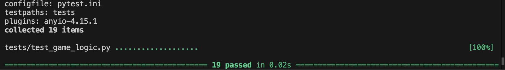

# 🎮 Game Glitch Investigator: The Impossible Guesser

## 🚨 The Situation

You asked an AI to build a simple "Number Guessing Game" using Streamlit.
It wrote the code, ran away, and now the game is unplayable. 

- You can't win.
- The hints lie to you.
- The secret number seems to have commitment issues.

## 🛠️ Setup

1. Install dependencies: `pip install -r requirements.txt`
2. Run the broken app: `python -m streamlit run app.py`

## 🕵️‍♂️ Your Mission

1. **Play the game.** Open the "Developer Debug Info" tab in the app to see the secret number. Try to win.
2. **Find the State Bug.** Why does the secret number change every time you click "Submit"? Ask ChatGPT: *"How do I keep a variable from resetting in Streamlit when I click a button?"*
3. **Fix the Logic.** The hints ("Higher/Lower") are wrong. Fix them.
4. **Refactor & Test.** - Move the logic into `logic_utils.py`.
   - Run `pytest` in your terminal.
   - Keep fixing until all tests pass!

## 📝 Document Your Experience

- [ ] Describe the game's purpose.
* The game is a number guessing game where you guess from a range from lowest to highest with the number of attempts effecting your score. You can choose to enable hints to know whether to go lower or higher
- [ ] Detail which bugs you found.
   * Too High" used to say "Go HIGHER!" and "Too Low" said "Go LOWER!"
   * The secret number kept changing between guesses
   * The on-screen text always says "between 1 and 100", whatever the difficulty.
   * The Hard range (1–50) is easier than Normal (1–100).
   * The attempt counter starts at 1 at the beginning, but at 0 after New Game.
   * update_score adds points for some wrong "Too High" guesses.
   * If you change difficulty partway through a game, the secret stays in the old range.
- [ ] Explain what fixes you applied.
   * I prompted AI to fix all of the above issues and I proofread all of them, tested and then played the game again in practice to verify if the issues were actually fixed.

## 📸 Demo Walkthrough

Describe your fixed game in numbered steps so a reader can follow along without watching a video:
1. User enters a guess of 40
2. Game returns "Too Low"
3. User enters a guess of 70, and the game shows "Too High"
4. Score updates correctly after each guess
5. Game ends after the correct guess

**Screenshot** *(optional)*: <!-- Insert a screenshot of your fixed, winning game here -->

## 🧪 Test Results

```
# Paste your pytest output here, e.g.:
# pytest tests/
# ========================= X passed in 0.XXs =========================
```
tests/test_game_logic.py ...................                                                             [100%]

================ 19 passed in 0.02s ================


## 🚀 Stretch Features

- [ ] [If you choose to complete Challenge 4, describe the Enhanced UI changes here — a screenshot is optional]
